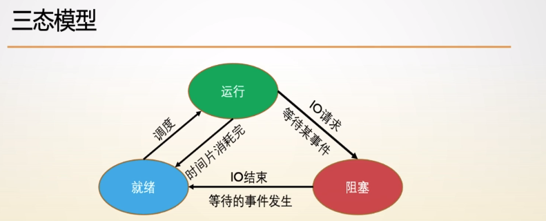

<!--more-->

## fork函数
> 函数原型
```cpp
#include <unistd.h>

pid_t fork(void);
```
返回值：
- 成功，父进程中返回子进程 pid， 子进程中返回 0；
- 失败，父进程返回 -1，没有子进程，errno被设置；

拷贝时刻：并不是在 fork 执行完成之后，而是在 内存发生变化时，才真正的拷贝。

> 示例 1
```cpp
#include <iostream>
#include <unistd>

int main() {
    char s[100] = {0};
    scanf("%s", s);
    printf("%s", s);

    fork();
    return 0;
}
```
注意：printf 是标准/缓冲IO，所以会输出两个 所输入内容。

> 示例 2
```cpp
#include <stdio.h>
#include <unistd.h>
#include <stdlib.h>

int main() {
    pid_t pid = 0;
	if((pid = fork()) < 0) {
		perror("fork()");
		exit(1);
	}eee
	if(pid == 0) {
		printf("Child Process!\n");
  	} else {
		printf("Parent Process!\n");
	}
    return 0;
}
```

注意：子进程先执行，还是父进程先执行，这点是不确定的。

## 僵尸进程
孤儿进程：父进程先于子进程结束，子进程变为孤儿进程；
僵尸进程：子进程先于父进程结束，子进程就成了僵尸进程，等待父进程收尸；

僵尸进程：子进程已经终止，但是父进程没有给它收尸（wait），这样的进程就变成了僵尸进程；

> 创建僵尸进程

> 查看僵尸进程
```bash
# defunct
ps

# defunct 
ps -ef | grep defunct

# defunct Z
ps aux | grep defunct

# zombie
top
```

## wait 函数
wait 函数：等待子进程的状态发生变化。

状态发生变化：
- 子进程终止；
- 子进程被信号停止；
- 子进程被信号重新启动；


> 函数原型
```cpp
#include <sys/wait.h>

pid_t wait(int *wstatus);

pid_t waitpid(pid_t pid, int *wstatus, int options);

int waitid(idtype_t idtype, id_t id, siginfo_t *infop, int options);

```


wait 返回值:
- 成功：返回任何一个已经终止的子进程的 ID；
- 失败：返回 -1；

waitpid 参数 pid：
- pid > 0 时，只等待进程ID为 pid 的子进程，只要该子进程还没结束，waitpid就会一直等下去；
- pid = -1 时，等待任何一个子进程退出，没有任何限制（相当于 wait）；
- pid = 0 时， 等待同一个进程组中的任何一个子进程，如果某个子进程已加入别的进程组，waitpid 则不会理睬它；
- pid < -1 时， 等待指定进程组（其 进程组 ID 为 pid 的绝对值） 中的任何子进程；

waitpid 参数 options
- WNOHANG: 如果

waitpid 返回值：
- pid 指定了一个子进程集合；
- 当这个子进程集合为空时，返回 -1；
- 当这个子进程集合不为空，且其中存在已经终止的子进程，则无需等待，直接返回某个已终止子进程的进程 ID。
- 当这个子进程集合不为空，且其中不存在已终止的子进程，
  - 默认等待，直到其中某个子进程终止；
  - 当 WNOHANG 存在时，则不等待，直接返回  0；

> 1 个子进程

```cpp


#include <stdio.h>
#include <stdlib.h>
#include <unistd.h>
#include <wait.h>

int main() {

    pid_t pid = 0;
	if((pid = fork()) < 0) {
		perror("fork error");
		exit(1);
	}
	if(pid == 0) {
		sleep(5);
		printf("child processing!\n");
        return 1;
	} else {
		int status = 0;
		int pid2 = 0;
		pid2 = wait(&status);
        printf("parent processing!\n");
		printf("status = %d\n", status);
		printf("pid1 = %d, pid2 = %d\n", pid, pid2);
	}
	return 0;
}
```

> 10 个子进程

```cpp

#include <stdio.h>
#include <stdlib.h>
#include <unistd.h>
#include <wait.h>

int main() {
    pid_t pid = 0;
	int i = 0;
	for(i = 1; i <= 10; ++i) {
		if((pid = fork()) < 0) {
			perror("fork error");
			exit(1);
		}
		if(pid == 0) break;
	}
	printf("我是第 %d 个孩子, pid = %d!\n", i, getpid());
	if(pid != 0) {
	    int status = 0;
		pid = wait(&status);
        //等到得不一定是第一个跑完进程得id
        //只能说明父进程不会第一个跑完
		printf("%d %d\n", pid, status);
	}
	return 0;
}
```

## exec 函数
exec 系列函数会让子进程去执行一个 “另外的程序” 。
> 函数原型
```cpp
#include <unistd.h>

extern char **environ;

int execl(const char *pathname, const char *arg, ...
                       /* (char  *) NULL */);
int execlp(const char *file, const char *arg, ...
                       /* (char  *) NULL */);
int execle(const char *pathname, const char *arg, ...
                       /*, (char *) NULL, char *const envp[] */);
int execv(const char *pathname, char *const argv[]);
int execvp(const char *file, char *const argv[]);
int execvpe(const char *file, char *const argv[],
                       char *const envp[]);
```

l / v: 表示可执行程序参数的传递方式：
- l : 表示参数以变参列表的形式给出，最后一个参数必须为 NULL；
- v : 表示参数以数组的形式给出，数组中最后一个元素必须为 NULL；

e：表示额外传递环境变量；

p：表示可执行持续需要借助于 PATH 路径查找；

## 命令行解析
函数原型
```cpp
#include <unistd.h>

int getopt(int argc, char * const argv[],
                  const char *optstring);

extern char *optarg;
extern int optind, opterr, optopt;

#include <getopt.h>

int getopt_long(int argc, char * const argv[],
                  const char *optstring,
                  const struct option *longopts, int *longindex);

int getopt_long_only(int argc, char * const argv[],
                  const char *optstring,
                  const struct option *longopts, int *longindex);
```
选项参数（option element）: argv 中以 “-” 或 “--” 开头的元素；

选项字符（option characters）：选项参中的字符；

返回值：重复调用 getopt 函数，每次返回一个选项字符；

optind: 
- 下一个被处理的数组元素的索引， 该值被系统初始化为 1；
- 重置该值为 1，从而可以重复扫描某些选项参数；

nextchar:
- 标记访问到了选项参数的第几个选项字符；

返回值：
- 当有选项字符时，返回选项字符；
- 当找不到选项字符时，返回 -1；

optstring 包含了指定了合法的选项字符有哪些：
- 如果选项字符后面接一个冒号，则说明该选项字符需要指定值；getopt会获取参数数组中下一个元素，并把该值读入到 optarg中。
- 选项字符后面接两个冒号：表明该选项字符带一个可选参数，该参数与可选字符属于同一单词，找到参数则把值放到 optarg中，否则 optarg为空；

## 文件锁
```cpp

#include <stdlib.h>
#include <stdio.h>
#include <unistd.h>
#include <wait.h>
#include <sys/file.h>

struct Msg {
    int now;
	int sum;
};


struct Msg num;

char *num_file = "./.shared";
char *lock_file = "./.lock";

size_t set_num(struct Msg *msg) {
	FILE *f = fopen(num_file, "w");
	if(f == NULL) {
		perror("fopen");
		return -1;
	}
    size_t nwrite = fwrite(msg, sizeof(struct Msg), 1, f);
	fclose(f);
	return nwrite;
}

size_t get_num(struct Msg *msg) {
	FILE *f = fopen(num_file, "r");
	if(f == NULL) {
		perror("fopen");
		return -1;
	}
	size_t nread = fread(msg, sizeof(struct Msg), 1, f);
	fclose(f);
	return nread;
}

void do_add(int end, int pid_num) {
    while(1) {

		FILE *f = fopen(num_file, "r+");
		flock(f->_fileno, LOCK_EX);
		fread(&num, sizeof(struct Msg), 1, f);
		//get_num(&num);
		if(num.now > end) { 
			fclose(f);
			break;
		}
		num.sum += num.now;
		num.now++;
		printf("The <%d>th child : now = %d, sum = %d\n", pid_num, num.now, num.sum);
		//<<C陷阱和缺陷>>中有提到一句,fread和fwirte混用时,一定要使用fseek().
		fseek(f, 0, SEEK_SET);

		fwrite(&num, sizeof(struct Msg), 1, f);
		flock(f->_fileno, LOCK_UN);
		fclose(f);

		/*FILE *lock = fopen(lock_file, "w");
		if(lock == NULL) {
			perror("fopen");
			exit(1);
		}
		flock(lock->_fileno, LOCK_EX);
		if(get_num(&num) < 0) {
			fclose(lock);
			continue;
		}

		if(num.now > end) {
			fclose(lock);
			break;
		}
		num.sum += num.now;
		num.now++;
		printf("The <%d>th child : now = %d, sum = %d\n", pid_num, num.now, num.sum);

        set_num(&num);
		flock(lock->_fileno, LOCK_UN);
		fclose(lock);*/
	}
}

int main(int argc, char *argv[]) {
	int opt, start = 0, end = 0, ins = 0;
	while((opt = getopt(argc, argv, "s:e:i:")) != -1) {
		switch(opt) {
			case 's':
				start = atoi(optarg);
				break;
			case 'e':
				end = atoi(optarg);
				break;
			case 'i':
				ins = atoi(optarg);
			    break;
			default:
				printf("Usage: %s -s start -e end -i cnt_process\n", argv[0]);
				break;
		}
	}
	printf("start = %d, end = %d, ins = %d\n", start, end, ins);
	num.now = 0; num.sum = 0;
	set_num(&num);

    pid_t pid = 0;
	int x = 0;
	for(int i = 1; i <= ins; ++i) {
		if((pid = fork()) < 0) {
			perror("fork error");
			exit(1);
		}
		if(pid == 0) {
			x = i;
			break;
		}
	}
	if(pid == 0) {
		do_add(end, x);
	} else {
		for(int i = 1; i <= ins; ++i) {
            wait(NULL);
		}
	}
    get_num(&num);

	printf("idx = %d, sum = %d\n", x, num.sum);
	return 0;
}
```

## 高级进程管理

### 进程调度
- 进程调度是一个内核子系统；
- 进程调度的主要任务是决定哪一个 “就绪” 状态的进程来执行；
- 就绪进程是非阻塞进程；
- 阻塞进程就是正在睡眠的进程，需要内核唤醒的进程；

三态模型
- 运行：
- 就绪：
- 阻塞：



> 从单任务到多任务
- DOS 是单任务操作系统，每次只能运行一个进程；
- 在单处理器的操作系统中，进程交错运行，从用户角度上看，仿佛多个任务在同时运行；
- 在多处理器的操作系统中，在不同的处理器上可以同时运行不同的任务，做到真正的并行；
- 所谓的调度：运行哪个进程运行多久。

> 协同和抢占式

协同：
- 进程会一直运行直到它自己结束。
- 操作系统不做任何干预；

抢占：
- 调度器决定进程何时结束并执行另一进程，这叫做抢占；
- 进程被抢占前运行的时间称为该进程的时间片；
- 调度器给每个进程分配一个处理器时间片。

> 时间片

- 时间片的长短会对于系统的全局行为和性能来说至关重要的。
- 时间片过长：提升系统吞吐率和全局性能
  - 进程执行前需要等待很长时间，降低了并发运行；
  - 用户感觉到明显的延迟；
- 时间片过短：提升交互性能
  - 大量的时间将花费在调度上；
  - 时间局部性带来的性能提升将大打折扣；
- 解决时间片长短问题：不用时间片；

> 完全公平调度：

使得每个进程的相邻两次调度不超过多长时间。
- 三个人，每人运行 10 min，同一进程的相邻两次调度不超过 30 min；
- 某个人优先级比较高，给他多分配时间，第一个人 20min，其它两个人 5min。

完全公平调度器
- cfs给n个进程每个进程分别分配1/n 的处理器时间；
- 然后通过优先级和权值调整分配，默认优先级为 0， 权值为 1；
- 优先级设置越小，优先级越高，权值越大，分配比例也增加；
- 为了确定每个进程真实的执行时间：引入目标延迟，目标延迟是调度的固定周期；
- 为了避免因为目标延迟设置过小导致每个进程的运行时间过短：引入最小粒度；
- 公平性：每个进程都会得到处理器资源的公平配额；

> IO约束型和处理器约束型

处理器约束型进程：一直消耗完可用时间片的进程
- 需要获取大量的cpu资源；
- 消耗点调度器分配的全部cpu；
- 对时间片要求：期望获得更长的时间片，从而最大化缓存命中，尽快完成任务；

IO约束型进程：多数时间处于阻塞状态或者等待资源的进程
- 经常阻塞在文件IO上：文件网络键盘鼠标；
- 也可能除了请求内核执行 IO 操作之外什么也不做；
- 对时间片要求：
  - 进程只会运行极短的时间，然后阻塞在内核资源；
  - 期望在自己阻塞后，更快的被唤醒，好进行下次 IO 操作，调度更多的IO操作，对资源有更高效的使用；
  - 一个等待用户输入的程序，被调度的越快，越有衔接无缝的感觉，听音乐也是如此；
  - 简而言之需要更短的时间片；

>   抢占式调度

传统 UNIX 进程调度时，内核给进程分配时间片，时间片用完，挂起该进程，执行其它进程；

- 如果此时系统中没有其它就绪的进程，内核给已经值行过的进程重新划分时间片，并重新执行；

- 进程的创建和终止就是进入和退出就绪队列；
- 如果有高优先级的进程，会优先运行这些进程，然后运行低优先级的进程；

