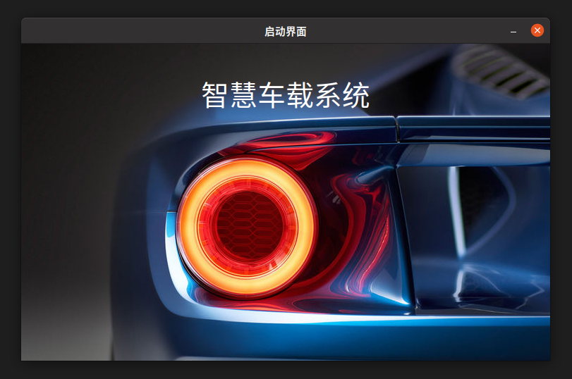
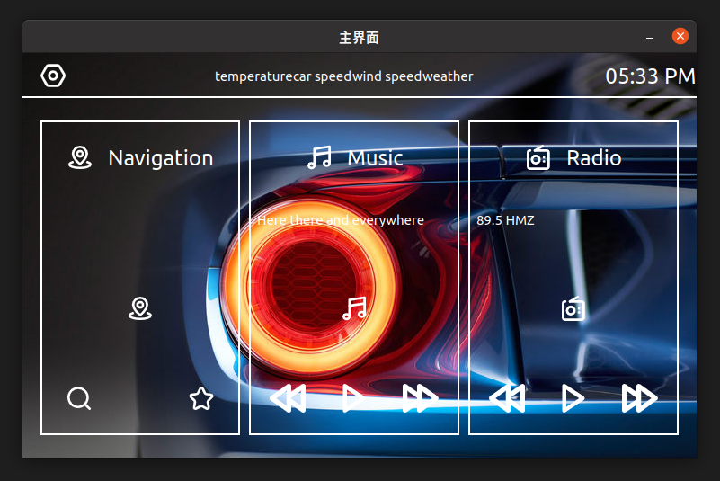
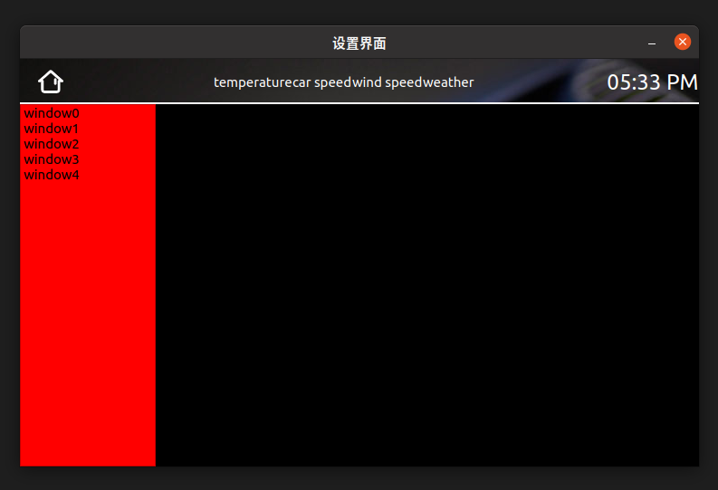

<!--more-->

## 截图




## 代码
### basecontroller
```cpp
//basecontroller.h
#ifndef BASECONTROLLER_H
#define BASECONTROLLER_H

#include <QObject>
#include "basemodel.h"
#include "baseview.h"
#include "Main/Tools/applicationmanager.h"

class BaseController : public QObject
{
public:
    explicit BaseController(QObject *parent = nullptr);
    virtual void show_view() = 0;
    virtual void hide_view() = 0;
protected:
    BaseView *view;
    BaseModel *model;
    ApplicationManager *manager;
};

#endif // BASECONTROLLER_H

```

```cpp
#include "basecontroller.h"
#include "baseview.h"

BaseController::BaseController(QObject *parent) : QObject(parent)
{

}
```
### basemodel

```cpp
#ifndef BASEMODEL_H
#define BASEMODEL_H

#include <QObject>

class BaseModel : public QObject
{
public:
    explicit BaseModel(QObject *parent = nullptr);
};

#endif // BASEMODEL_H
```

```cpp

#include "basemodel.h"

BaseModel::BaseModel(QObject *parent) : QObject(parent)
{

}

```
### baseview
```cpp
#ifndef BASEVIEW_H
#define BASEVIEW_H

#include "basemodel.h"
#include <QWidget>
class BaseController;
class BaseView : public QWidget
{
public:
    explicit BaseView(QWidget *parent = nullptr);
    virtual void set_model(BaseModel *) = 0;
protected:
    BaseController *controller;
};

#endif // BASEVIEW_H
```

### applicationmanager
```cpp
#ifndef APPLICATIONMANAGER_H
#define APPLICATIONMANAGER_H

#include <QObject>
#include <QVector>
class BaseController;

class ApplicationManager : public QObject
{
    Q_OBJECT
public:
    explicit ApplicationManager(QObject *parent = nullptr);
    void go();
    void change_controller(int);
private:
    void init_controllers();
    void show();
    void hide();
private:
    int current;
    QVector<BaseController *> *controllers;
signals:

public slots:
};

#endif // APPLICATIONMANAGER_H

```

```cpp
#include "applicationmanager.h"
#include "Main/Base/basecontroller.h"
#include "Modules/Launch/launchcontroller.h"
#include "Modules/Major/majorcontroller.h"
#include "Modules/Settings/settingscontroller.h"

ApplicationManager::ApplicationManager(QObject *parent) : QObject(parent)
{
    controllers = new QVector<BaseController *>();
    init_controllers();
}

void ApplicationManager::init_controllers()
{
    //启动界面载入
    BaseController *newLaunch = new LaunchController(this);
    controllers->push_back(newLaunch);
    //主界面载入
    BaseController *newMajor = new MajorController(this);
    controllers->push_back(newMajor);
    //设置界面载入
    BaseController *newSettings = new SettingsController(this);
    controllers->push_back(newSettings);

    current = 0;
}

void ApplicationManager::change_controller(int index)
{
    if(index >= 3 || index == current) return;

    hide();
    current = index;
    show();
}
void ApplicationManager::go()
{
    show();
}

void ApplicationManager::show()
{
    controllers->at(current)->show_view();
}

void ApplicationManager::hide()
{
    controllers->at(current)->hide_view();
}
```

### launchcontroller

```cpp
#ifndef LAUNCHCONTROLL_H
#define LAUNCHCONTROLL_H

#include "Main/Base/basecontroller.h"

class LaunchController : public BaseController
{
public:
    LaunchController(ApplicationManager *);
    void show_view() override;
    void hide_view() override;
};

#endif // LAUNCHCONTROLL_H

```

```cpp
#include "launchcontroller.h"
#include "launchview.h"
#include "launchmodel.h"

#include<QTimer>

LaunchController::LaunchController(ApplicationManager *app_manager)
{
    this->manager = app_manager;

    view = new LaunchView(this);
    view->setWindowTitle("启动界面");
    view->setFixedSize(750, 450);

    model = new LaunchModel();
    view->set_model(model);

    QTimer *timer = new QTimer(this);
    connect(timer, &QTimer::timeout, [=](){
        if(timer->isActive() == true)
        {
            timer->stop();
            manager->change_controller(1);
        }
    });
    timer->start(20000);

}

void LaunchController::show_view()
{
    view->show();
}

void LaunchController::hide_view()
{
    view->hide();
}


```

### launchmodel

```cpp
#ifndef LAUNCHMODEL_H
#define LAUNCHMODEL_H

#include "Main/Base/basemodel.h"

struct LaunchModel : public BaseModel
{
    QString name = "智慧车载系统";
    QString logo = ":/Image/background3.jpg";
};

#endif // LAUNCHMODEL_H

```

```cpp
#include "launchmodel.h"

```

### launchview

```cpp
#ifndef LAUNCHVIEW_H
#define LAUNCHVIEW_H

#include "Main/Base/baseview.h"
#include <QLabel>

class LaunchView : public BaseView
{
public:
    LaunchView(BaseController *);
    void set_model(BaseModel *) override;
    //void paintEvent(QPaintEvent *event) override;
private:
    void set_title(BaseModel *);
    void set_logo(BaseModel *);
private:
    QLabel *title;
    QLabel *logo;
};

#endif // LAUNCHVIEW_H

```

```cpp
#include "launchview.h"
#include "launchmodel.h"
#include <QImage>
#include <QGraphicsOpacityEffect>
#include <QTimer>
#include <QPen>
#include <QPainter>
#include <QDebug>
LaunchView::LaunchView(BaseController *ctl)
{
    controller = ctl;

    //显示顺序与初始化顺序有关
    logo = new QLabel(this);
    title = new QLabel(this);

}

void LaunchView::set_model(BaseModel *base_model)
{
    set_title(base_model);
    set_logo(base_model);
}

void LaunchView::set_title(BaseModel *base_model)
{
    LaunchModel *model = dynamic_cast<LaunchModel *>(base_model);

    //设置label大小
    title->setText(model->name);
    title->setMinimumHeight(100);
    title->setMaximumHeight(100);
    //title->setStyleSheet("background:red");
    title->setMinimumWidth(this->width());

    //设置字体大小
    QFont ft;
    ft.setPointSize(30);
    title->setFont(ft);

    QPalette pal;
    pal.setColor(QPalette::WindowText, Qt::white);
    title->setPalette(pal);

    title->setAlignment(Qt::AlignBottom | Qt::AlignHCenter);
}

void LaunchView::set_logo(BaseModel *base_model)
{
    LaunchModel *model = dynamic_cast<LaunchModel *>(base_model);
    QPalette pal = this->palette();
    pal.setBrush(QPalette::Background, QBrush(QPixmap(model->logo)));
    setPalette(pal);

    //透明度
    /*double opacity = 0.01;
    QGraphicsOpacityEffect *effect = new QGraphicsOpacityEffect(this);
    effect->setOpacity(opacity);
    //定时器完成渐变

    QTimer *timer = new QTimer(this);
    connect(timer, &QTimer::timeout, [=]()mutable{
        if(opacity >= 1)
        {
            timer->stop();
        }
        else
        {
            qDebug() << opacity;
            effect->setOpacity(opacity);
            logo->setGraphicsEffect(effect);
        }
        opacity += 0.01;
    });
    timer->start(50);*/
}

/*void LaunchView::paintEvent(QPaintEvent *event)
{
    static int diff = 0;
    int temp = this->height() / 3 * 2;
    diff = diff == temp ? temp : diff + 1;
    int sx1 = this->width() / 8;
    int sy1 = this->height();
    int ex1 = sx1 + diff;
    int ey1 = sy1 - diff;

    int sx2 = this->width() / 8 * 7;
    int sy2 = this->height();
    int ex2 = sx2 - diff;
    int ey2 = sy2 - diff;

    QPen *pen = new QPen();
    pen->setColor(QColor(255, 255, 255));
    pen->setWidth(10);
    QPainter *painter = new QPainter(this);
    painter->setPen(*pen);
    painter->drawLine(sx1, sy1, ex1, ey1);
    painter->drawLine(sx2, sy2, ex2, ey2);
    painter->end();
}*/

```

### majorcontroller

```cpp
#ifndef MAJORCONTROLLER_H
#define MAJORCONTROLLER_H

#include "Main/Base/basecontroller.h"

class MajorController : public BaseController
{
    Q_OBJECT
public:
    MajorController(ApplicationManager *);
    void show_view() override;
    void hide_view() override;
signals:

public slots:
    void to_settings_page();
};

#endif // MAJORCONTROLLER_H

```

```cpp
#include "majorcontroller.h"
#include "majorview.h"
#include "majormodel.h"

MajorController::MajorController(ApplicationManager *app_manager)
{
    this->manager = app_manager;

    view = new MajorView(this);
    view->setWindowTitle("主界面");
    view->setFixedSize(750, 450);

    model = new MajorModel();
    view->set_model(model);
}

void MajorController::show_view()
{
    view->show();
}

void MajorController::hide_view()
{
    view->hide();
}

void MajorController::to_settings_page()
{
    manager->change_controller(2);
}


```

### majormodel

```cpp
#ifndef MAJORMODEL_H
#define MAJORMODEL_H

#include "Main/Base/basemodel.h"

struct MajorModel : public BaseModel
{

};

#endif // MAJORMODEL_H

```

```cpp
#include "majormodel.h"


```

### majorview

```cpp
#ifndef MAJORVIEW_H
#define MAJORVIEW_H

#include "Main/Base/baseview.h"
#include <QLabel>
#include <QGraphicsView>
#include <QPushButton>

class MajorView : public BaseView
{
public:
    MajorView(BaseController *);
    void set_model(BaseModel *) override;
private:
    void init_toolbar();
    void init_menu();
    void init_locate();
    void init_music();
    void init_radio();
private:
    QWidget *toolbar;
    QPushButton *setting;
    QLabel *temperature;
    QLabel *car_speed;
    QLabel *wind_speed;
    QLabel *weather;
    QPushButton *time;

    QWidget *menu;
    QWidget *locate;
    QWidget *music;
    QWidget *radio;

    QPushButton *locate_title;
    QLabel *locate_detail;
    QGraphicsView *locate_icon;
    QPushButton *locate_search;
    QPushButton *locate_collect;

    QPushButton *music_title;
    QLabel *music_detail;
    QGraphicsView *music_icon;
    QPushButton *music_previous;
    QPushButton *music_pause;
    QPushButton *music_next;

    QPushButton *radio_title;
    QLabel *radio_detail;
    QGraphicsView *radio_icon;
    QPushButton *radio_previous;
    QPushButton *radio_pause;
    QPushButton *radio_next;
};

#endif // MAJORVIEW_H

```

```cpp
#include "majorview.h"
#include "majormodel.h"
#include "majorcontroller.h"

#include <QVBoxLayout>
#include <QHBoxLayout>
#include <QGridLayout>
#include <QIcon>
#include <QFrame>

MajorView::MajorView(BaseController *ctl)
{
    controller = ctl;
}

void MajorView::set_model(BaseModel *base_model)
{
    QPalette pal = this->palette();
    pal.setBrush(QPalette::Background, QBrush(QPixmap(":/Image/background3.jpg")));
    setPalette(pal);

    toolbar = new QWidget(this);
    menu = new QWidget(this);
    QVBoxLayout *layout = new QVBoxLayout();
    layout->setContentsMargins(0, 0, 0, 0);
    layout->setSpacing(0);
    layout->addWidget(toolbar);
    layout->addWidget(menu);
    this->setLayout(layout);

    init_toolbar();
    init_menu();
}

void MajorView::init_toolbar()
{
    toolbar->setMinimumHeight(50);
    toolbar->setMaximumHeight(50);
    toolbar->setStyleSheet("border-bottom:2px solid white;");

    QIcon icon_settings(":/Image/settings-32.png");
    setting = new QPushButton(icon_settings, "", toolbar);
    setting->setIconSize(QSize(64, 64));
    setting->setFlat(true);
    setting->setStyleSheet("QPushButton{border:none;background:transparent;}");

    temperature = new QLabel("temperature", toolbar);
    temperature->setStyleSheet("color:white;");
    car_speed = new QLabel("car speed", toolbar);
    car_speed->setStyleSheet("color:white;");
    wind_speed = new QLabel("wind speed", toolbar);
    wind_speed->setStyleSheet("color:white;");
    weather = new QLabel("weather", toolbar);
    weather->setStyleSheet("color:white;");
    time = new QPushButton("05:33 PM", toolbar);
    QFont ft;
    ft.setPointSize(18);
    time->setFont(ft);
    time->setFlat(true);
    time->setStyleSheet("QPushButton{border:none;background:transparent;color:white;}");

    QHBoxLayout *layout = new QHBoxLayout();
    layout->setSpacing(10);
    layout->setContentsMargins(0, 5, 0, 5);
    layout->setSpacing(0);
    layout->addWidget(setting);
    layout->addStretch();
    layout->addWidget(temperature);
    layout->addWidget(car_speed);
    layout->addWidget(wind_speed);
    layout->addWidget(weather);
    layout->addStretch();
    layout->addWidget(time);
    toolbar->setLayout(layout);
    //MajorController *temp = dynamic_cast<MajorController *>(controller);
    connect(setting, SIGNAL(clicked()), controller, SLOT(to_settings_page()));
}

void MajorView::init_menu()
{
    //menu->setStyleSheet("background:green");
    locate = new QWidget(menu);
    music = new QWidget(menu);
    radio = new QWidget(menu);
    QHBoxLayout *layout = new QHBoxLayout();
    layout->setContentsMargins(20, 25, 20, 25);
    layout->setSpacing(10);
    layout->addWidget(locate);
    layout->addWidget(music);
    layout->addWidget(radio);
    menu->setLayout(layout);

    init_locate();
    init_music();
    init_radio();
}

void MajorView::init_locate()
{
    locate->setMinimumWidth(menu->width() / 3);
    locate->setStyleSheet("border:2px solid white;");


    QIcon icon_title(":/Image/locate-32.png");
    locate_title = new QPushButton(icon_title, "  Navigation", locate);
    locate_title->setIconSize(QSize(64, 64));
    locate_title->setFlat(true);
    locate_title->setStyleSheet("QPushButton{border:none;background:transparent;color:white;}");
    QFont ft;
    ft.setPointSize(18);
    locate_title->setFont(ft);
    QPalette pal;
    pal.setColor(QPalette::WindowText, Qt::white);
    locate_title->setPalette(pal);

    locate_detail = new QLabel("", locate);
    locate_detail->setStyleSheet("border: 0px; color: white;");

    locate_icon = new QGraphicsView(locate);
    QGraphicsScene *scene = new QGraphicsScene();
    scene->addPixmap(QPixmap(":/Image/locate-32.png"));
    locate_icon->setScene(scene);
    locate_icon->setStyleSheet("border:0px;background:transparent;");

    QIcon icon_search(":/Image/search.png");
    locate_search = new QPushButton(icon_search, "", locate);
    locate_search->setIconSize(QSize(64, 64));
    locate_search->setFlat(true);
    locate_search->setStyleSheet("QPushButton{border:none;background:transparent;}");


    QIcon icon_collect(":/Image/collect.png");
    locate_collect = new QPushButton(icon_collect, "", locate);
    locate_collect->setIconSize(QSize(64, 64));
    locate_collect->setFlat(true);
    locate_collect->setStyleSheet("QPushButton{border:none;background:transparent;}");

    QGridLayout *layout = new QGridLayout();
    layout->addWidget(locate_title, 0, 0, 1, 3);
    layout->addWidget(locate_detail, 1, 0, 1, 3);
    layout->addWidget(locate_icon, 2, 0, 2, 3);
    layout->addWidget(locate_search, 4, 0, 1, 1);
    layout->addWidget(locate_collect, 4, 2, 1, 1);
    locate->setLayout(layout);
}

void MajorView::init_music()
{
    music->setMinimumWidth(menu->width() / 3);
    music->setStyleSheet("border:2px solid white;");

    QIcon icon_title(":/Image/music-32.png");
    music_title = new QPushButton(icon_title, "  Music", music);
    music_title->setIconSize(QSize(64, 64));
    music_title->setFlat(true);
    music_title->setStyleSheet("QPushButton{border:none;background:transparent;color:white;}");
    QFont ft;
    ft.setPointSize(18);
    music_title->setFont(ft);


    music_detail = new QLabel("Here there and everywhere", music);
    music_detail->setStyleSheet("border: 0px; color: white;");

    music_icon = new QGraphicsView(music);
    QGraphicsScene *scene = new QGraphicsScene();
    scene->addPixmap(QPixmap(":/Image/music-32.png"));
    music_icon->setScene(scene);
    music_icon->setStyleSheet("border:0px;background:transparent;");

    QIcon icon_pre(":/Image/pre.png");
    music_previous = new QPushButton(icon_pre, "", music);
    music_previous->setIconSize(QSize(64, 64));
    music_previous->setFlat(true);
    music_previous->setStyleSheet("QPushButton{border:none;background:transparent;}");

    QIcon icon_play(":/Image/play.png");
    music_pause = new QPushButton(icon_play, "", music);
    music_pause->setIconSize(QSize(64, 64));
    music_pause->setFlat(true);
    music_pause->setStyleSheet("QPushButton{border:none;background:transparent;}");

    QIcon icon_next(":/Image/next.png");
    music_next = new QPushButton(icon_next, "", music);
    music_next->setIconSize(QSize(64, 64));
    music_next->setFlat(true);
    music_next->setStyleSheet("QPushButton{border:none;background:transparent;}");

    QGridLayout *layout = new QGridLayout();
    layout->addWidget(music_title, 0, 0, 1, 3);
    layout->addWidget(music_detail, 1, 0, 1, 3);
    layout->addWidget(music_icon, 2, 0, 2, 3);
    layout->addWidget(music_previous, 4, 0, 1, 1);
    layout->addWidget(music_pause, 4, 1, 1, 1);
    layout->addWidget(music_next, 4, 2, 1, 1);
    music->setLayout(layout);
}

void MajorView::init_radio()
{
    radio->setMinimumWidth(menu->width() / 3);
    radio->setStyleSheet("border:2px solid white;");

    QIcon icon_title(":/Image/radio-32.png");
    radio_title = new QPushButton(icon_title, "  Radio", radio);
    radio_title->setIconSize(QSize(64, 64));
    radio_title->setFlat(true);
    radio_title->setStyleSheet("QPushButton{border:none;background:transparent;color:white;}");
    QFont ft;
    ft.setPointSize(18);
    radio_title->setFont(ft);

    radio_detail = new QLabel("89.5 HMZ", radio);
    radio_detail->setStyleSheet("border: 0px; color: white;");

    radio_icon = new QGraphicsView(radio);
    QGraphicsScene *scene = new QGraphicsScene();
    scene->addPixmap(QPixmap(":/Image/radio-32.png"));
    radio_icon->setScene(scene);
    radio_icon->setStyleSheet("border:0px;background:transparent;");

    QIcon icon_pre(":/Image/pre.png");
    radio_previous = new QPushButton(icon_pre, "", radio);
    radio_previous->setIconSize(QSize(64, 64));
    radio_previous->setFlat(true);
    radio_previous->setStyleSheet("QPushButton{border:none;background:transparent;}");

    QIcon icon_play(":/Image/play.png");
    radio_pause = new QPushButton(icon_play, "", radio);
    radio_pause->setIconSize(QSize(64, 64));
    radio_pause->setFlat(true);
    radio_pause->setStyleSheet("QPushButton{border:none;background:transparent;}");

    QIcon icon_next(":/Image/next.png");
    radio_next = new QPushButton(icon_next, "", radio);
    radio_next->setIconSize(QSize(64, 64));
    radio_next->setFlat(true);
    radio_next->setStyleSheet("QPushButton{border:none;background:transparent;}");

    QGridLayout *layout = new QGridLayout();
    layout->addWidget(radio_title, 0, 0, 1, 3);
    layout->addWidget(radio_detail, 1, 0, 1, 3);
    layout->addWidget(radio_icon, 2, 0, 2, 3);
    layout->addWidget(radio_previous, 4, 0, 1, 1);
    layout->addWidget(radio_pause, 4, 1, 1, 1);
    layout->addWidget(radio_next, 4, 2, 1, 1);
    radio->setLayout(layout);
}

```

### settingscontroller

```cpp
#ifndef SETTINGSCONTROLLER_H
#define SETTINGSCONTROLLER_H

#include "Main/Base/basecontroller.h"

class SettingsController : public BaseController
{
    Q_OBJECT
public:
    SettingsController(ApplicationManager *);
    void show_view() override;
    void hide_view() override;
signals:

public slots:
    void to_home_page();
};

#endif // SETTINGSCONTROLLER_H

```

```cpp
#include "settingscontroller.h"
#include "settingsview.h"
#include "settingsmodel.h"

SettingsController::SettingsController(ApplicationManager *app_manager)
{
    this->manager = app_manager;

    view = new SettingsView(this);
    view->setWindowTitle("设置界面");
    view->setFixedSize(750, 450);

    model = new SettingsModel();
    view->set_model(model);
}

void SettingsController::show_view()
{
    view->show();
}

void SettingsController::hide_view()
{
    view->hide();
}

void SettingsController::to_home_page()
{
    manager->change_controller(1);
}

```

### settingsmodel

```cpp
#ifndef SETTINGSMODEL_H
#define SETTINGSMODEL_H

#include "Main/Base/basemodel.h"

struct SettingsModel : public BaseModel
{

};

#endif // SETTINGSMODEL_H

```

```cpp
#include "settingsmodel.h"


```

### settingsview

```cpp
#ifndef SETTINGSVIEW_H
#define SETTINGSVIEW_H

#include "Main/Base/baseview.h"
#include <QLabel>
#include <QPushButton>
#include <QListWidget>
#include <QStackedWidget>

class SettingsView : public BaseView
{
public:
    SettingsView(BaseController *);
    void set_model(BaseModel *) override;
private:
    void init_toolbar();
    void init_menu();
    void init_list();
    void init_stacked();
private:
    QWidget *toolbar;
    QPushButton *home;
    QLabel *temperature;
    QLabel *car_speed;
    QLabel *wind_speed;
    QLabel *weather;
    QPushButton *time;

    QWidget *menu;
    QListWidget *list;
    QStackedWidget *stacked;
};

#endif // SETTINGSVIEW_H

```

```cpp
#include "settingsview.h"
#include "settingscontroller.h"
#include <QVBoxLayout>
#include <QHBoxLayout>
#include <QIcon>

SettingsView::SettingsView(BaseController *ctl)
{
    controller = ctl;
}

void SettingsView::set_model(BaseModel *base_model)
{
    QPalette pal = this->palette();
    pal.setBrush(QPalette::Background, QBrush(QPixmap(":/Image/background3.jpg")));
    setPalette(pal);

    toolbar = new QWidget(this);
    menu = new QWidget(this);
    QVBoxLayout *layout = new QVBoxLayout();
    layout->setContentsMargins(0, 0, 0, 0);
    layout->setSpacing(0);
    layout->addWidget(toolbar);
    layout->addWidget(menu);
    this->setLayout(layout);

    init_toolbar();
    init_menu();
}

void SettingsView::init_toolbar()
{
    toolbar->setMinimumHeight(50);
    toolbar->setMaximumHeight(50);
    toolbar->setStyleSheet("border-bottom:2px solid white;");

    QIcon icon_home(":/Image/home-32.png");
    home = new QPushButton(icon_home, "", toolbar);
    home->setIconSize(QSize(64, 64));
    home->setFlat(true);
    home->setStyleSheet("QPushButton{border:none;background:transparent;}");

    temperature = new QLabel("temperature", toolbar);
    temperature->setStyleSheet("color:white;");
    car_speed = new QLabel("car speed", toolbar);
    car_speed->setStyleSheet("color:white;");
    wind_speed = new QLabel("wind speed", toolbar);
    wind_speed->setStyleSheet("color:white;");
    weather = new QLabel("weather", toolbar);
    weather->setStyleSheet("color:white;");
    time = new QPushButton("05:33 PM", toolbar);
    QFont ft;
    ft.setPointSize(18);
    time->setFont(ft);
    time->setFlat(true);
    time->setStyleSheet("QPushButton{border:none;background:transparent;color:white;}");

    QHBoxLayout *layout = new QHBoxLayout();
    layout->setContentsMargins(0, 0, 0, 0);
    layout->setSpacing(0);
    layout->addWidget(home);
    layout->addStretch();
    layout->addWidget(temperature);
    layout->addWidget(car_speed);
    layout->addWidget(wind_speed);
    layout->addWidget(weather);
    layout->addStretch();
    layout->addWidget(time);
    toolbar->setLayout(layout);

    connect(home, SIGNAL(clicked()), controller, SLOT(to_home_page()));
}

void SettingsView::init_menu()
{
    list = new QListWidget(menu);
    stacked = new QStackedWidget(menu);
    QHBoxLayout *layout = new QHBoxLayout();
    layout->setContentsMargins(0, 0, 0, 0);
    layout->setSpacing(0);
    layout->addWidget(list);
    layout->addWidget(stacked);
    menu->setLayout(layout);

    init_list();
    init_stacked();
}

void SettingsView::init_list()
{
    list->setMaximumWidth(150);
    list->setStyleSheet("background:red");
    list->insertItem(0, "window0");
    list->insertItem(1, "window1");
    list->insertItem(2, "window2");
    list->insertItem(3, "window3");
    list->insertItem(4, "window4");
}

void SettingsView::init_stacked()
{
    stacked->setStyleSheet("background:black");
}

```