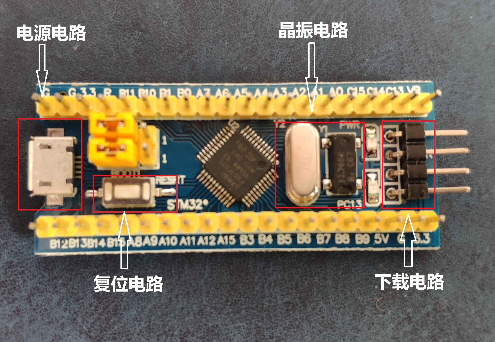
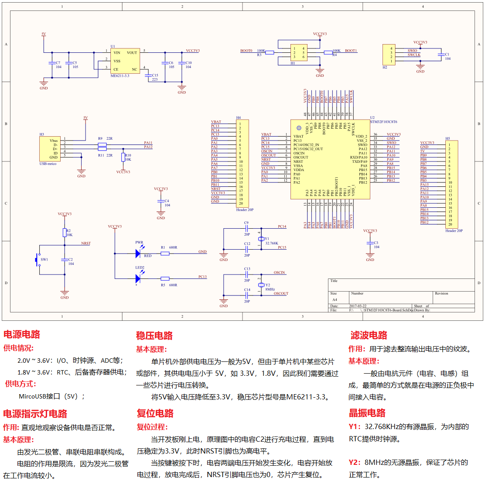

<!--more-->
## 基本概念
> 你所买的最小系统板主芯片的完整型号是什么,你是怎么得知它的型号的?

型号：STM32F103C8T, CMU 上刻有型号信息。

> 你的最小系统板的电路是由哪几部分所构成,他们主要的作用是什么?
- 电源电路: 供电（5v）
  - 2.0v ~ 3.6v : I/O、时钟源、ADC等；
  - 1.8v ~ 3.6v : RTC、后备寄存器；
- 晶振电路: 产生不同频率的稳定的交流信号；
  - Y1：32.768KHZ 的有源晶振，为内部的 RTC 提供时钟源；
  - Y2：8MHZ 的无源晶振，保证芯片的正常工作；
- 复位电路: 复位。
- 下载电路: 烧录程序。

> 结合实物图,请你在实物图上画框,然后标记处对应是最小系统的哪一部分。

> 你所使用的 STM32 的存储部件有哪些,在哪里,大小分别是多少,分别有什么作用?

在 MCU 里面：
- Flash Memory：64kb，存储固定程序和数据；
- SRAM：20kb，暂时存储程序、数据和中间结果；

## 电路基础
> 如下图,为一个基本的 LED 电路图,请计算出其串联的电阻的
阻值范围(列出公式)。

设：串联电阻阻值为 r, 电源电压为 Up，LED 压降为 Ud ,额定电流为 I , 则限流电阻阻值约为：
r = (Up - Ud) / I

> 课程中我们提到,滤波电路中的滤波的一种方式就是将电容的两端分别接在电源的两极,
如下图,请回答如下问题:
> - 上图 C7 的 104 表示这个电容具体的容值是多大。
> - C5 和 C7 不同容值的电容在滤波中的作用有什么区别。

> 同样是电阻,他们在下面电路中的作用分别是什么?

- 第一个：控制干路电流大小；
- 第二个：保护电路，防止当开关按下，电路中电流过高导致电路损坏；
- 第三个：限流，防止 LED 烧坏；

## 图纸阅读
> 获取自己所采购的单片机的原理图,并在原理图中相应位置标明部件的作用,将标注结
果截图到文档中

型号：STM32F103C8T6

> 阅读如下芯片手册中的一段内容,总结获取的信息。
STM32F103xx 系列芯片包括：
- 内核：ARM Cortex-M3;
- 内存：
  - Flash Memory：128kb；
  - SRAM：20kb；
- 2 个 12-bit ADC；
- 计时器：
  - 3 个通用 16-bit 计时器；
  - 1 个 PWM 计时器；
- 接口：
  - 2 个 i2C;
  - 2 个 SPI ;
  - 3 个 USART ;
  - 1 个 USB ;
  - 1 个 CAN ;

运行情况：
- 工作电压为 2.0v ~ 3.6v;
- 可在 -40° ~ 105° 环境下使用；
- 支持低功耗模式；

不同的型号外设配备情况不同。

应用十分广泛。

## 提高题
> 从 KKB 毕业后,你进入一家智能终端公司,接手主导负责智能手环的研发。现需要召集你的团队对项目的主芯片进行选型,请你完成如下任务:
> - 分析一下智能手环硬件基本组成以及各部件对应的功能作用。
> - 从你的角度完成智能手环主芯片的选型,并给出大体的成本价格。

> 从 KKB 毕业后,你进入了某为公司,你拿到一个国产的海思开发板,领导让你在一周内
熟悉好这个开发板,请给出你一周拿下这个开发板的思路和步骤。

1、去官网下载手册、图纸、相关软件等资料

2、了解开发板硬件组成，及每部分详细信息

3、看尺寸图、原理图 了解硬件之间是如何连接及交互的。

4、简单测试，实现一些简单的功能。